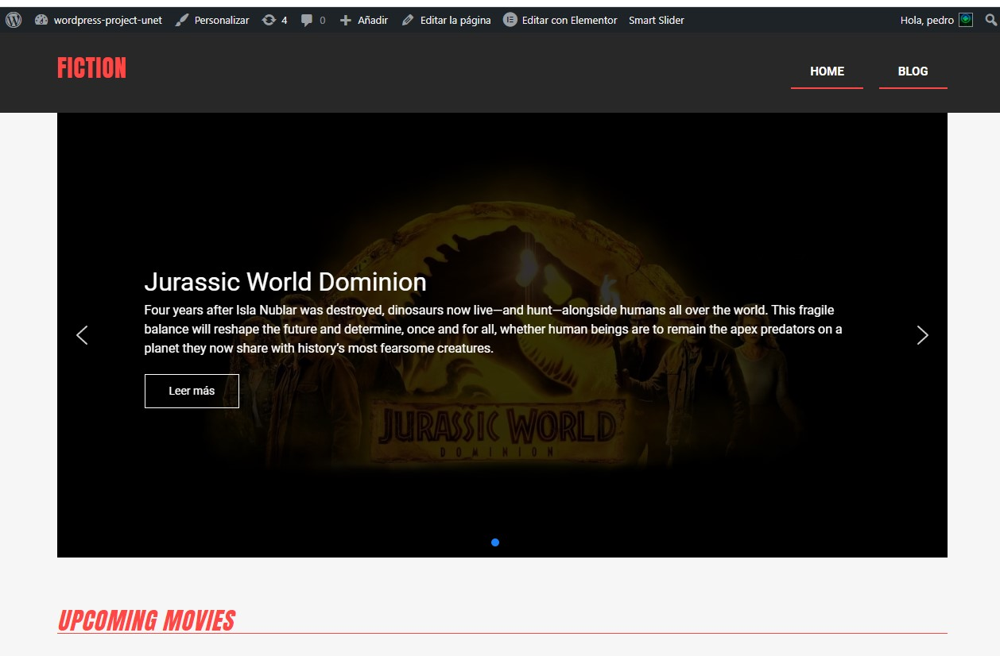
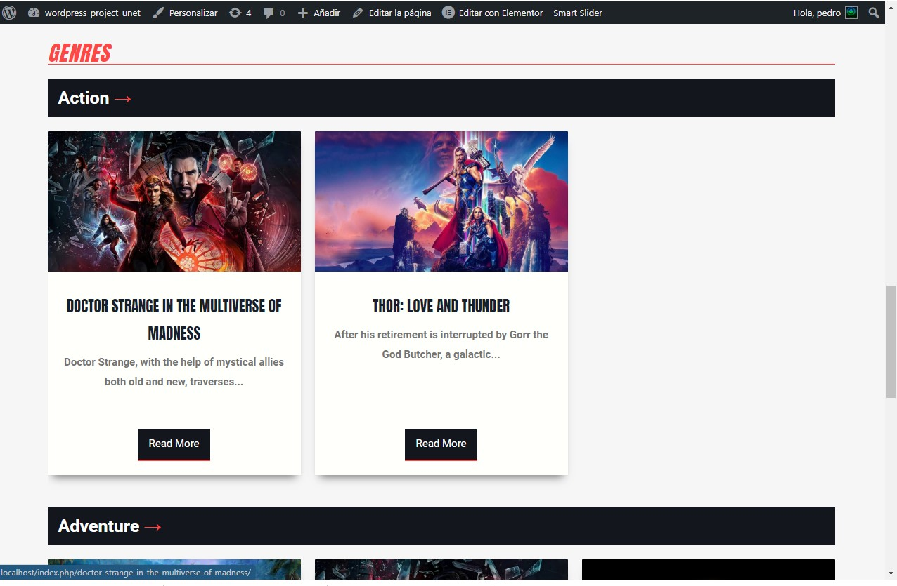

# wordpress-project-unet

- Pedro Soto
- CI: 27.893.308
- Project Wordpress

## Instrucciones:

1. Descargue o clone este repositorio
2. Cree una base de datos en su gestor de base de datos
3. Inicie Un nuevo proyecto de wordpress
4. Durante la inctalacion del Wordpress use el nombre de la base de datos creada con anterioridad
5. Una vez que se encuentre dentro del dashboard de Wordpress: instale el plugin "All-in-One WP Migration" y activelo
6. Una vez instalado el plugin, uselo e importe el archivo "localhost-20220719-142846-7vytlt.wpress"
7. Finalizada la importacion y restauracion del "All-in-One WP Migration" recargue la pagina del dashboard.
8. A cotinuacion inicie session con las siguiente credenciales:
    #### Usuario: pedro
    #### Contraseña: 12345678
9. Y Listo, Dentro de su dashboard Click en "Visitar el sitio".
10. Evalue. :)

## Disculpe profesor no Pude subirlo a ningun servidor, lo intente en 000WebHost pero al momento de importar todo me daba error al tratar deacceder internamente a un archivo sin accso de escritura y no pude resolverlo.

#Evidencia

